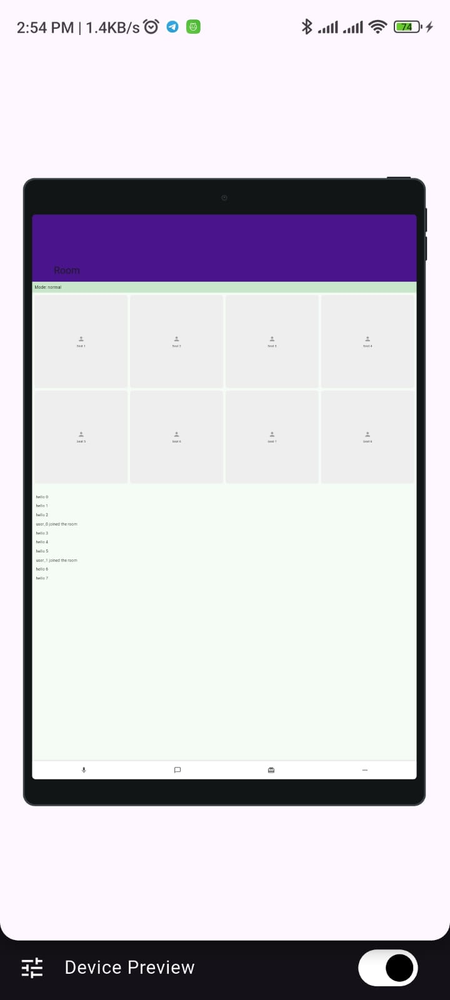

# Visual & UX Bugs Report

## Bug #1: Nested Scroll & Fixed Chat Height
- **Where:** `RoomScreenMini` → Chat Messages List
- **Steps to reproduce:**
  1. Open Room Screen on small device
  2. Wait for chat messages to load
  3. Try scrolling from inside chat area
- **Expected behavior:** Smooth single scroll for entire page
- **Actual behavior:** Chat has fixed height so it's nested scroll. Bottom of chat area stays empty
- **Screenshot:** `answers/screenshots/small_device.jpeg`
- **Severity:** High
- **Proposed fix:** Replace `ListView` in `SizedBox(height: 300)` with `SliverList.builder`

---

## Bug #2: "Room" Title Invisible on Purple Background
- **Where:** `RoomScreenMini` → SliverAppBar title
- **Steps to reproduce:**
  1. Open Room Screen
- **Expected behavior:** Title text clearly visible against background
- **Actual behavior:** "Room" text is black on purple background - completely invisible
- **Screenshot:** `answers/screenshots/small_device.jpeg`
- **Severity:** High
- **Proposed fix:** Change title color to `Colors.white` in `FlexibleSpaceBar`

---

## Bug #3: Mode Container Too Small & Fixed
- **Where:** `RoomScreenMini` → Mode badge ("Mode: normal")
- **Steps to reproduce:**
  1. Open Room Screen on any device
  2. Look at mode container above seats
- **Expected behavior:** Container scales with screen size, text readable
- **Actual behavior:** Fixed tiny height, text stays small even on large screens
- **Screenshot:** `
- **Severity:** Medium
- **Proposed fix:** Remove fixed height, use `SliverPadding` + responsive text

---

## Bug #4: Seat Grid Stretches on Large Screens
- **Where:** `RoomScreenMini` → Seat Grid
- **Steps to reproduce:**
  1. Open Room on large device
  2. Look at seat cards layout
- **Expected behavior:** Seats keep normal square proportions
- **Actual behavior:** 4 columns stretch super wide across large screen
- **Screenshot:** `answers/screenshots/large_device.jpeg`
- **Severity:** Medium
- **Proposed fix:** Use `SliverGridDelegateWithMaxCrossAxisExtent(maxCrossAxisExtent: 100)`

---

## Bug #5: Chat Empty Space Wastes Screen Real Estate
- **Where:** `RoomScreenMini` → Chat area (large device)
- **Steps to reproduce:**
  1. Open Room on large device
  2. Wait for a few chat messages
- **Expected behavior:** Chat fills available space or shows empty state
- **Actual behavior:** Chat has fixed height, leaves huge empty space below messages
- **Screenshot:** `answers/screenshots/large_device.jpeg`
- **Severity:** Medium
- **Proposed fix:** Remove fixed height container, let `SliverList` use full space

---

## Bug #6: Seats Distorted in Landscape Mode
- **Where:** `RoomScreenMini` → Seat Grid (landscape)
- **Steps to reproduce:**
  1. Open Room Screen
  2. Rotate to landscape
- **Expected behavior:** Grid adapts to wider screen
- **Actual behavior:** Seat cards become extremely wide and squished
- **Screenshot:** `answers/screenshots/land_scape.jpeg`
- **Severity:** Medium
- **Proposed fix:** Replace fixed `crossAxisCount: 4` with `maxCrossAxisExtent`

---

